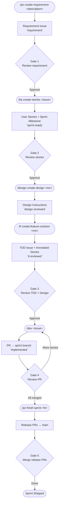
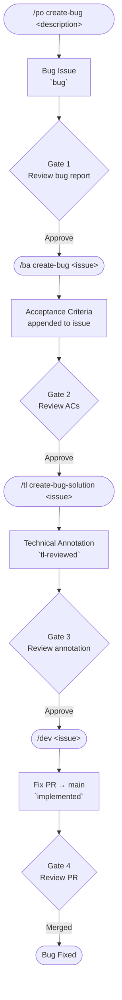

# AI Development Workflow

An AI-powered development workflow using Claude Code slash commands. Issue tracker and all project-specific values defined in `project.md` — making the workflow reusable across projects.

---

## Contents

- [How It Works](#how-it-works)
  - [Full Workflow](#full-workflow)
  - [Bug Workflow](#bug-workflow)
- [Commands](#commands)
- [Structure](#structure)
- [Setup for a New Project](#setup-for-a-new-project)
- [Label Reference](#label-reference)

---

## How It Works



Each phase ends with a **human gate** — review the output before running the next command.

### Full Workflow

#### 0. Create a requirement
```
/po create-requirement Build a user authentication system with OAuth
```

To update an existing requirement:
```
/po update-requirement 42 Drop OAuth, use magic link instead
```

#### 1. Run BA
```
/ba create-stories 42
```

**Human gate**: Review the stories. Edit or close any that don't fit. Get the milestone ID from the URL (`.../milestone/3`).

#### 2. Run Designer
```
/design create-design 3
```
**Human gate**: Review the design instructions issue. (If no UI work found, the designer exits early — skip to Step 3.)

#### 3. Run Technical Lead
```
/tl create-feature-solution 3
```

**Human gate**: Review the TDD issue and story annotations on the issue tracker.

#### 4. Run Dev(s)
Auto-pick an unassigned ticket:
```
/dev
```

Or target a specific issue:
```
/dev 45
```

**Human gate**: Review the PR diff. When approved, merge into the sprint feature branch.

#### 5. Finish the sprint
```
/po finish-sprint 3
```

**Human gate**: Review and merge the release PRs.

### Bug Workflow

Separate pipeline for production bugs — runs independently of the sprint cycle. Bug PRs always target `main`.



---

## Commands

| Command | Role | Input | Output |
|---------|------|-------|--------|
| `/po create-requirement <description>` | Product Owner | raw requirement text | requirement issue with `requirement` label |
| `/po update-requirement <issue> <delta>` | Product Owner | issue # + change description | updated requirement issue with `requirement-updated` label |
| `/po create-bug [description]` | Product Owner | bug description (optional) | bug issue with `bug` label (interactively fills missing fields) |
| `/ba create-stories <issue-number>` | BA | requirement issue # | user story issues + sprint milestone (`sprint-ready`) |
| `/ba create-bug <issue-number>` | BA | bug issue # | ACs appended to bug ticket |
| `/ba update-stories <issue-number>` | BA | requirement issue # | updated user stories (add/update/remove) after requirement change |
| `/ba change-story <issue-number>` | BA | story or bug issue # | updated ACs on existing story or bug + downstream TDD/design adapted |
| `/design create-design <milestone-id>` | Designer | milestone # | sprint-level design instructions issue (`design-reviewed`) — or updates existing if requirement changed |
| `/tl create-feature-solution <milestone-id>` | Technical Lead | milestone # | TDD issue + feature branches + annotated stories (`tl-reviewed` + `skill:*`) |
| `/tl create-bug-solution <bug-issue>` | Technical Lead | bug issue # | technical annotation comment on bug ticket (`tl-reviewed` + `skill:*`) |
| `/dev [issue-number]` | Developer (auto) | optional issue # | PR to sprint branch (stories) or main (bugs) — auto-routes to implement/refactor/revert based on labels |
| `/po finish-sprint <sprint-number>` | Release Manager | sprint # | sprint issues closed (`sprint-completed`), story branches deleted, release PRs to main, migrations flagged |

Skills: `frontend` · `backend` · `fullstack` · `devops`

`/dev` auto-selects agent from `skill:` labels. Multi-skill tickets run agents in parallel. TDD: tests first, then code. One ticket per invocation.

---

## Structure

```
.claude/
  project.md            ← primary config: repo, tech stack, labels, branch patterns, tracker adapter
  commands/             ← slash commands (orchestration + methodology)
    po.md
    po/
      mode-standard.md
      mode-change.md
      mode-bug.md
    ba.md
    design.md
    tl.md
    po/
      finish-sprint.md
  agents/               ← developer role agents (invoked by /dev)
    backend.md
    frontend.md
    devops.md
  trackers/             ← tracker adapters (swap to change issue tracker)
    github-tracker.md
  skills/               ← git utilities used by commands
    git-strategy/
    git-operations/
  scripts/              ← setup scripts
    create-github-labels.sh
```

**`project.md`** is the primary config: repo, codebases, tech stack, labels, branch patterns, architecture doc paths, test/lint commands, and active tracker adapter path.

**Commands** are self-contained: each file includes the role methodology and calls tracker operations by name.

**Agents** are developer personas invoked by `/dev`. Each follows TDD: understand requirements → write tests → implement code to pass tests.

**Trackers** define how abstract workflow operations (`fetch_issue`, `create_pr`, etc.) map to a specific issue tracker. Swap `trackers/github-tracker.md` for `trackers/jira.md` and update `project.md` — zero changes to command files.

---

## Setup for a New Project

1. Copy the `.claude/` directory to your project
2. Edit `.claude/project.md` with your project's values:
   - Issue tracker type, repo, and tracker adapter path
   - Codebase paths and tech stack
   - Architecture doc locations
   - Label names
   - Git branch patterns and test/lint commands
3. Run `scripts/create-github-labels.sh` to create labels on the repo
4. To use a different issue tracker: create `.claude/trackers/jira.md` using the same operation interface as `github-tracker.md`, then update the tracker adapter path in `project.md`
5. Start with `/po <requirement description>` or open a requirement issue manually and run `/ba <issue-number>`

---

## Label Reference

| Label | Meaning |
|-------|---------|
| `requirement` | PO-created requirement |
| `user-story` | BA-created story |
| `bug` | Reporter-created bug issue |
| `sprint-ready` | Awaiting design/TL |
| `tl-reviewed` | TL complete — awaiting dev |
| `technical-design` | TDD issue |
| `design-reviewed` | Sprint-level design instructions created — awaiting dev |
| `in-progress` | Dev is implementing |
| `implemented` | Dev complete — awaiting review |
| `sprint-completed` | Sprint closed |

> Label names are configurable in `project.md`.
