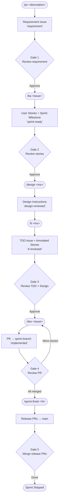
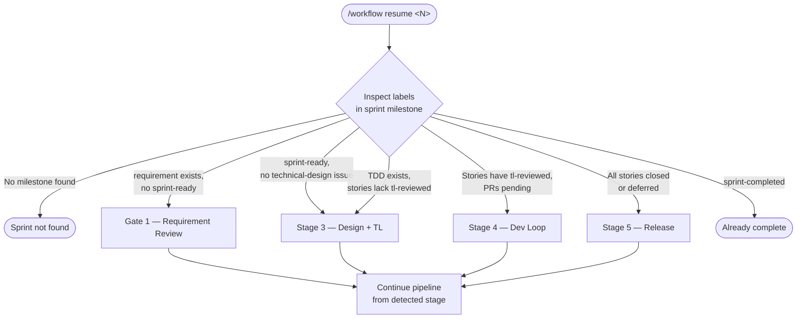
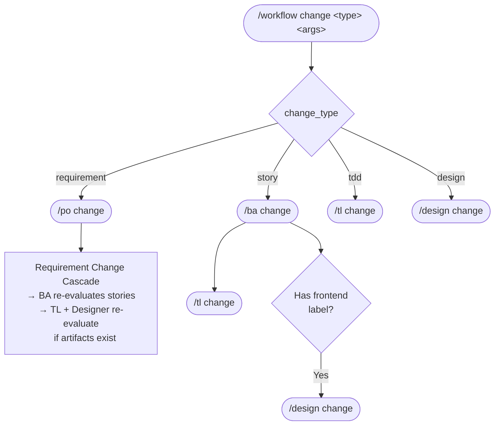
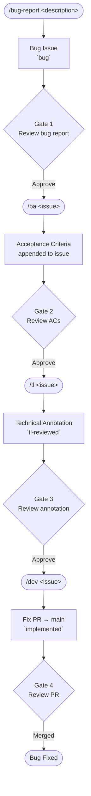

# AI Development Workflow

An AI-powered development workflow using Claude Code slash commands. Issue tracker and all project-specific values defined in `project.md` — making the workflow reusable across projects.

---

## Contents

- [How It Works](#how-it-works)
- [Commands](#commands)
- [Structure](#structure)
- [Setup for a New Project](#setup-for-a-new-project)
- [Full Workflow](#full-workflow)
- [Label Reference](#label-reference)
- [Bug Workflow](#bug-workflow)

---

## How It Works



Each phase ends with a **human gate** — review the output before running the next command.

> `/workflow` orchestrates this entire pipeline. Run `/workflow new` to start a sprint, `/workflow resume` to continue, `/workflow change` to trigger change management.

### Resume

`/workflow resume <sprint_number>` — detects the furthest completed stage from issue labels and jumps back in.



### Change Management

`/workflow change <type> <args>` — routes directly to the affected role without replaying the full pipeline.



---

## Commands

| Command | Role | Input | Output |
|---------|------|-------|--------|
| `/po <description>` | Product Owner | raw requirement text | requirement issue with `requirement` label |
| `/bug-report <description>` | Bug Reporter | bug description | bug issue with `bug` label |
| `/ba <issue-number>` | BA | requirement or bug issue # | user story issues + sprint milestone (requirements) — or ACs added to bug ticket |
| `/design <milestone-id>` | Designer | milestone # | sprint-level design instructions issue labelled `design-reviewed` |
| `/tl <milestone-id or bug-issue>` | Technical Lead | milestone # or bug issue # | TDD issue + annotated stories (sprints) — or technical annotation on bug ticket |
| `/dev [issue-number]` | Developer (auto) | optional issue # | implementation + PR to sprint branch (stories) or main (bugs) |
| `/sprint-finish <sprint-number>` | Release Manager | sprint # | sprint closed, TDD archived, release PRs opened |
| `/workflow <mode>` | Orchestrator | `new` / `resume` / `change` | full pipeline orchestration with human gates |

Skills: `frontend` · `backend` · `fullstack` · `devops`

`/dev` auto-selects the agent (`agents/backend.md`, `agents/frontend.md`, or `agents/devops.md`) based on `skill:` labels on the ticket. Multi-skill tickets activate multiple agents in parallel.

---

## Structure

```
.claude/
  project.md            ← primary config: repo, tech stack, labels, branch patterns, tracker adapter
  commands/             ← slash commands (orchestration + methodology)
    po.md
    ba.md
    workflow.md         ← pipeline orchestrator (new/resume/change modes)
    design.md
    tl.md
    bug-report.md
    sprint-finish.md
  agents/               ← developer role agents (invoked by /dev)
    backend.md
    frontend.md
    devops.md
  trackers/             ← tracker adapters (swap to change issue tracker)
    github-tracker.md
  skills/               ← git utilities used by commands
    git-strategy/
    git-operations/
  scripts/              ← setup scripts
    create-github-labels.sh
```

**`project.md`** is the primary config: repo, codebases, tech stack, labels, branch patterns, architecture doc paths, test/lint commands, and active tracker adapter path.

**Commands** are self-contained: each file includes the role methodology and calls tracker operations by name.

**Agents** are developer personas invoked by `/dev`. Each has a 4-stage workflow: understand requirements → explore code → implement → write tests.

**Trackers** define how abstract workflow operations (`fetch_issue`, `create_pr`, etc.) map to a specific issue tracker. Swap `trackers/github-tracker.md` for `trackers/jira.md` and update `project.md` — zero changes to command files.

---

## Setup for a New Project

1. Copy the `.claude/` directory to your project
2. Edit `.claude/project.md` with your project's values:
   - Issue tracker type, repo, and tracker adapter path
   - Codebase paths and tech stack
   - Architecture doc locations
   - Label names
   - Git branch patterns and test/lint commands
3. Run `scripts/create-github-labels.sh` to create labels on the repo
4. To use a different issue tracker: create `.claude/trackers/jira.md` using the same operation interface as `github-tracker.md`, then update the tracker adapter path in `project.md`
5. Start with `/po <requirement description>` or open a requirement issue manually and run `/ba <issue-number>`

---

## Full Workflow

### 0. Create a requirement
```
/po Build a user authentication system with OAuth
```
Creates a requirement issue with `requirement` label. Or open an issue manually on your repo.

### 1. Run BA
```
/ba 42
```
BA brainstorms with you to eliminate ambiguity, then creates 3–8 user stories in a new sprint milestone.

**Human gate**: Review the stories. Edit or close any that don't fit. Get the milestone ID from the URL (`.../milestone/3`).

### 2. Run Designer
```
/design 3
```
Designer reads all sprint stories, identifies UI-affecting work from their descriptions and ACs, analyzes the design system (components, tokens, layouts), and creates a sprint-level design instructions issue covering layout, components, tokens, states, responsive behavior, and accessibility for the feature as a whole. Runs before the TL so design intent informs the technical design.

**Human gate**: Review the design instructions issue. (If no UI work found, the designer exits early — skip to Step 3.)

### 3. Run Technical Lead
```
/tl 3
```
TL reads the design instructions and architecture docs, designs the solution, writes a TDD issue (including a `## Story Breakdown` section with per-story skill, complexity, scope, and key decisions), and labels each story with `tl-reviewed` and its `skill:` label.

**Human gate**: Review the TDD issue and story annotations on the issue tracker.

### 4. Run Dev(s)
Auto-pick an unassigned ticket:
```
/dev
```

Or target a specific issue:
```
/dev 45
```

Agent is auto-selected from `skill:` labels on the ticket (backend → `agents/backend.md`, frontend → `agents/frontend.md`, etc.). Multi-skill tickets run multiple agents in parallel.

**Human gate**: Review the PR diff. When approved, merge into the sprint feature branch.

### 5. Finish the sprint
```
/sprint-finish 3
```
Release manager checks all stories are merged, labels and closes all sprint issues, archives the TDD to `docs/designs/sprint-N.md`, and opens release PRs (sprint branch → main) per codebase.

**Human gate**: Review and merge the release PRs.

---

## Label Reference

| Label | Meaning |
|-------|---------|
| `requirement` | PO-created requirement |
| `user-story` | BA-created story |
| `bug` | Reporter-created bug issue |
| `sprint-ready` | Awaiting design/TL |
| `tl-reviewed` | TL complete — awaiting dev |
| `technical-design` | TDD issue |
| `design-reviewed` | Sprint-level design instructions created — awaiting dev |
| `in-progress` | Dev is implementing |
| `implemented` | Dev complete — awaiting review |
| `sprint-completed` | Sprint closed |
| `skill:frontend` | Frontend story or bug |
| `skill:backend` | Backend story or bug |
| `skill:fullstack` | Full-stack story |
| `skill:devops` | Infrastructure story |

> Label names are configurable in `project.md`.

---

## Bug Workflow

Separate pipeline for production bugs — runs independently of the sprint cycle. Bug PRs always target `main`.



`/ba`, `/tl`, and `/dev` detect the `bug` label automatically and switch to Bug Mode — no separate commands needed.
