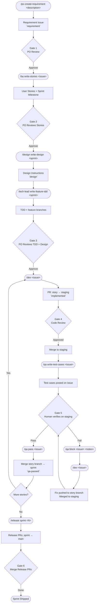
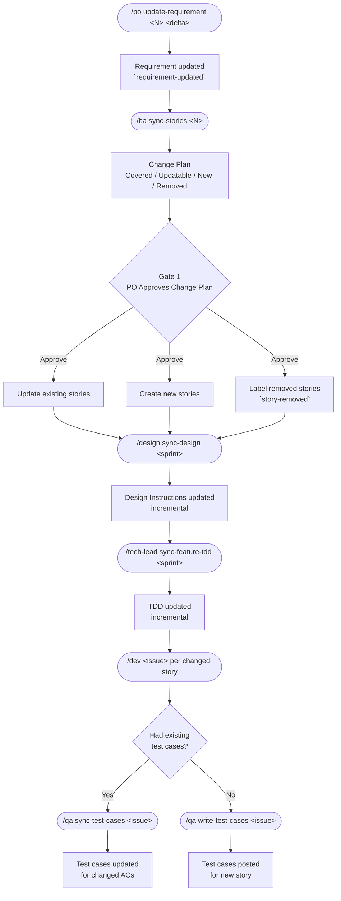
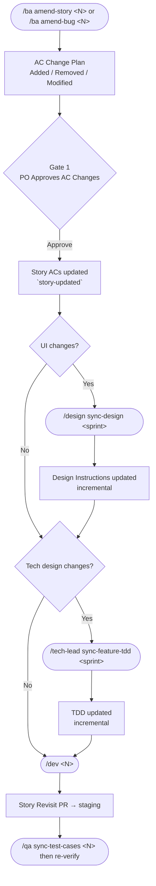

# AI Development Workflow

An AI-powered development workflow using Claude Code slash commands.

---

## Contents

- [Roles](#roles)
- [How It Works](#how-it-works)
  - [Feature Development](#feature-development)
  - [Production Hotfix](#production-hotfix)
  - [Requirements Change](#requirements-change)
  - [Story Change](#story-change)
- [Commands](#commands)
- [Structure](#structure)
- [Label Reference](#label-reference)

---

## Roles

| Role | Who | Responsibilities |
|------|-----|-----------------|
| **Product Owner (PO)** | Human | Owns the requirement — creates, updates, prioritises. |
| **Business Analyst (BA)** | AI (BA persona) | Turns requirements into user stories with acceptance criteria. Manages scope changes. |
| **Designer** | AI (Designer persona) | Reads the design system, produces sprint-level UI instructions for frontend stories. |
| **Technical Lead (TL)** | AI (TL persona) | Reads architecture, designs system-level solution, writes TDD for features. |
| **Developer** | AI (backend/frontend/devops) | Implements one story or bug per invocation. TDD: tests first, then code. |
| **QA Engineer** | AI (QA persona) + Human | AI generates test cases per story from ACs. Human verifies on staging and signals pass/fail. |
| **Release Manager** | AI (release persona) | Closes sprints and hotfixes — verifies readiness, closes issues, cleans branches, opens release PRs, flags migrations. |

---

## How It Works

### Feature Development

Story branches are merged to **staging** for QA verification. Only after QA passes does the story branch merge to the **sprint branch**. The sprint branch stays clean — it contains only verified work.



### Production Hotfix

Separate pipeline for bugs found in production — runs independently of the sprint cycle. Fix PRs target **staging** for QA verification before merging to `main`.


### Requirements Change

Triggered when the PO changes scope mid-sprint. Cascades through stories, design, TDD, dev, and QA.



### Story Change

Triggered when a specific story's acceptance criteria need adjusting — not the overall requirement.



**When to involve Designer and TL:**

| Change type | Designer | TL |
|-------------|----------|----|
| New UI surface or interaction | Yes | Maybe |
| Changed layout, component, or visual state | Yes | Maybe |
| New API endpoint or data model | No | Yes |
| Changed business logic or backend behaviour | No | Yes |
| UI + backend change together | Yes | Yes |
| Copy/label wording only | No | No |

Human judges which roles are needed after reviewing approved AC changes.

---

## Commands

### Product Owner

| Command | Input | Output |
|---------|-------|--------|
| `/po create-requirement <description>` | Raw requirement text | Requirement issue with `requirement` label |
| `/po update-requirement <issue> <delta>` | Issue # + change description | Updated requirement with `requirement-updated` label |
| `/po create-bug [description]` | Bug description (optional) | Bug issue with `bug-production` label |

### Business Analyst

| Command | Input | Output |
|---------|-------|--------|
| `/ba write-stories <issue>` | Requirement issue # | User story issues + sprint milestone |
| `/ba add-bug-acs <issue>` | Bug issue # | ACs appended to bug issue |
| `/ba sync-stories <issue>` | Requirement issue # | Updated stories after requirement change |
| `/ba amend-story <issue>` | Story issue # | Updated ACs + `story-updated` label |
| `/ba amend-bug <issue>` | Bug issue # | Updated ACs on bug issue |

### Designer

| Command | Input | Output |
|---------|-------|--------|
| `/design write-design <sprint>` | Sprint milestone # | Sprint-level design instructions issue (`design`) |
| `/design sync-design <sprint>` | Sprint milestone # | Updated design instructions after story changes |

### Technical Lead

| Command | Input | Output |
|---------|-------|--------|
| `/tech-lead write-feature-tdd <sprint>` | Sprint milestone # | TDD issue + feature branches |
| `/tech-lead sync-feature-tdd <sprint>` | Sprint milestone # | Updated TDD after story changes |

### Developer

| Command | Input | Output |
|---------|-------|--------|
| `/dev <issue>` | Story or bug issue # | PR to staging — auto-routes by label: implement / story-revisit / qa-fix / revert |

**Routing priority:**

| Label on issue | Mode |
|----------------|------|
| `bug-production` + `story-updated` | Bug Revisit |
| `bug-production` + `qa-blocked` | QA Fix (Bug) — fixes failing test cases on bug branch, re-merges to staging |
| `bug-production` | Bug Fix |
| `story-removed` | Revert |
| `qa-blocked` | QA Fix — fixes failing test cases on story branch, re-merges to staging |
| `story-updated` | Story Revisit — implements AC delta only |
| _(none)_ | Standard — full implementation |

Dev auto-selects backend/frontend/devops agent(s). Multi-skill stories run agents in parallel. One ticket per invocation.

### QA Engineer

| Command | Input | Output |
|---------|-------|--------|
| `/qa write-test-cases <issue>` | Story or bug issue # (must be `implemented`) | Test cases comment posted on issue — one table per AC |
| `/qa sync-test-cases <issue>` | Story issue # | Test cases updated when ACs change (`story-updated`) |
| `/qa pass <issue>` | Story or bug issue # | `qa-passed` label applied — human then merges branch → sprint or main |
| `/qa block <issue> <notes>` | Story or bug issue # + failure notes | `qa-blocked` label applied — triggers dev qa-fix cycle |
| `/qa load-context <issue>` | Story or bug issue # | Displays existing test cases and QA status |

QA never runs test commands. Test execution and verification is human-only. Test steps are user-action steps against a running staging environment.

### Release Manager

| Command | Input | Output |
|---------|-------|--------|
| `/release sprint <N>` | Sprint # | All sprint issues closed, story branches deleted, release PRs (sprint → main), migrations flagged |
| `/release hotfix <issue>` | Bug issue # | Bug issue closed (`bug-fixed`), fix branch deleted, summary posted |

---

## Structure

```
.claude/
  commands/             ← slash commands (orchestration + methodology)
    po.md
    po/
      create-requirement.md   ← PO creates new requirement
      update-requirement.md   ← PO changes requirement mid-sprint
      create-bug.md           ← PO creates bug report
    ba.md
    ba/
      write-stories.md        ← BA decomposes requirement into stories
      add-bug-acs.md          ← BA writes ACs for a bug issue
      sync-stories.md         ← BA re-classifies stories after requirement change
      amend-story.md          ← BA amends ACs on a user story
      amend-bug.md            ← BA amends ACs on a bug issue
    design.md
    design/
      write-design.md         ← Designer produces UI instructions for sprint
      sync-design.md          ← Designer updates design instructions after story changes
    tech-lead.md
    tech-lead/
      write-feature-tdd.md    ← TL writes TDD for sprint
      sync-feature-tdd.md     ← TL updates TDD after story changes
    dev.md
    dev/
      implement.md            ← Dev implements a story (standard)
      fix-bug.md              ← Dev investigates and fixes a bug
      story-revisit.md        ← Dev implements AC delta changes
      qa-fix.md               ← Dev fixes failing QA test cases on story branch (user-story)
      qa-fix-bug.md          ← Dev fixes failing QA test cases on bugfix branch (bug-production)
      revert.md               ← Dev reverts when story removed from scope
    qa.md
    qa/
      write-test-cases.md     ← QA generates test cases from story ACs
      sync-test-cases.md      ← QA updates test cases after AC changes
      pass.md                 ← QA marks story passed — triggers sprint merge
      block.md                ← QA marks story blocked — triggers dev qa-fix
      load-context.md         ← QA loads existing test cases and status
    release.md
    release/
      sprint.md               ← Release Manager closes sprint, opens release PRs
      hotfix.md               ← Release Manager closes bug, cleans branches
  agents/               ← developer role agents (invoked by /dev)
    backend.md
    frontend.md
    devops.md
  skills/               ← shared utilities
    artifacts/
      references/             ← issue, PR, and comment templates
    git/
    github/
    common-rules/
  scripts/              ← setup scripts
    create-github-labels.sh
```

---

## Label Reference

| Label | Meaning |
|-------|---------|
| `requirement` | PO-created requirement |
| `requirement-updated` | Requirement changed mid-sprint |
| `user-story` | BA-created story |
| `technical-design` | TDD issue |
| `design` | Sprint-level design instructions issue |
| `in-progress` | Dev is implementing |
| `implemented` | Dev complete — PR merged to staging, awaiting QA |
| `qa-passed` | Human verified all test cases on staging — ready to merge to sprint |
| `qa-blocked` | One or more test cases failed — dev qa-fix required |
| `story-updated` | Story ACs changed after initial implementation |
| `story-removed` | Story dropped from scope |
| `sprint-completed` | Sprint closed |
| `bug-production` | Reporter-created bug issue |
| `bug-fixed` | Bug closed after successful fix |
