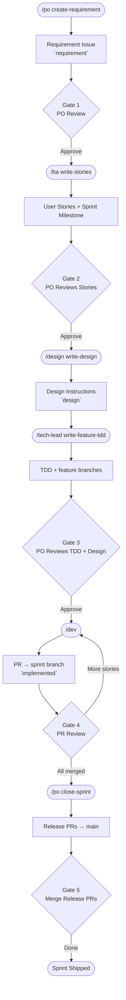
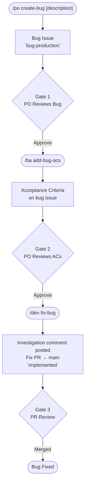
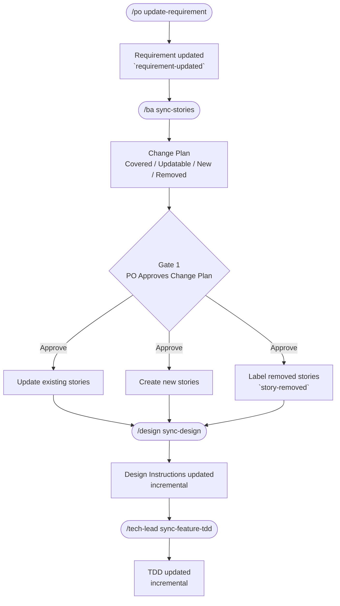
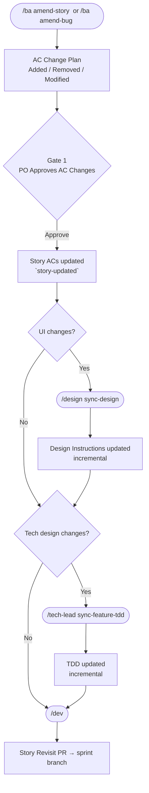

# AI Development Workflow

An AI-powered development workflow using Claude Code slash commands.
---

## Contents

- [Roles](#roles)
- [How It Works](#how-it-works)
  - [Feature Development](#feature-development)
  - [Bug Fixing](#bug-fixing)
  - [Requirements Change](#requirements-change)
  - [Story Change](#story-change)
- [Commands](#commands)
- [Structure](#structure)
- [Label Reference](#label-reference)

---

## Roles

| Role | Who | Responsibilities |
|------|-----|-----------------|
| **Product Owner (PO)** | User | Owns the requirement — creates, updates, prioritises. Closes sprints and bugs. |
| **Business Analyst (BA)** | AI (BA persona) | Turns requirements into user stories with acceptance criteria. Manages scope changes. |
| **Designer** | AI (Designer persona) | Reads the design system, produces sprint-level UI instructions for frontend stories. |
| **Technical Lead (TL)** | AI (TL persona) | Reads architecture, designs system-level solution, writes TDD for features. |
| **Developer** | AI (backend/frontend/devops) | Implements one story or bug per invocation. TDD: tests first, then code. |
| **Release Manager** | AI (PO persona) | Closes sprints — verifies all PRs merged, closes issues, cleans branches, opens release PRs, flags migrations. |

---

## How It Works

### Feature Development



### Bug Fixing

Separate pipeline — runs independently of sprint cycle. Bug PRs always target `main`.



### Requirements Change

Triggered when the PO changes scope mid-sprint. Affects stories, design, and TDD.



### Story Change

Triggered when a specific story's acceptance criteria need adjusting — not the overall requirement.



**When to involve Designer and TL:**

| Change type | Designer | TL |
|-------------|----------|----|
| New UI surface or interaction | Yes | Maybe |
| Changed layout, component, or visual state | Yes | Maybe |
| New API endpoint or data model | No | Yes |
| Changed business logic or backend behaviour | No | Yes |
| UI + backend change together | Yes | Yes |
| Copy/label wording only | No | No |

Human judges which roles are needed after reviewing approved AC changes.

---

## Commands

| Command | Role | Input | Output | Example |
|---------|------|-------|--------|---------|
| `/po create-requirement <description>` | Product Owner | raw requirement text | requirement issue with `requirement` label | `/po create-requirement Build a user authentication system with OAuth` |
| `/po update-requirement <issue> <delta>` | Product Owner | issue # + change description | updated requirement issue with `requirement-updated` label | `/po update-requirement 42 Drop OAuth, use magic link instead` |
| `/po create-bug [description]` | Product Owner | bug description (optional) | bug issue with `bug-production` label (interactively fills missing fields) | `/po create-bug` |
| `/po close-sprint <sprint-number>` | Release Manager | sprint # | sprint issues closed, story branches deleted, release PRs to main, migrations flagged | `/po close-sprint 3` |
| `/po close-bug <issue-number>` | Release Manager | bug # | bug issue closed (`bug-fixed`), fix branch deleted, summary posted | `/po close-bug 42` |
| `/ba write-stories <issue-number>` | BA | requirement issue # | user story issues + sprint milestone | `/ba write-stories 42` |
| `/ba add-bug-acs <issue-number>` | BA | bug issue # | ACs appended to bug ticket | `/ba add-bug-acs 42` |
| `/ba sync-stories <issue-number>` | BA | requirement issue # | updated user stories (add/update/remove) after requirement change | `/ba sync-stories 42` |
| `/ba amend-story <issue-number>` | BA | story issue # | updated ACs on existing story + `story-updated` label | `/ba amend-story 45` |
| `/ba amend-bug <issue-number>` | BA | bug issue # | updated ACs on existing bug + `story-updated` label | `/ba amend-bug 42` |
| `/design write-design <milestone-id>` | Designer | milestone # | sprint-level design instructions issue (`design`) | `/design write-design 3` |
| `/design sync-design <milestone-id>` | Designer | milestone # | updates existing design instructions after story changes | `/design sync-design 3` |
| `/tech-lead write-feature-tdd <milestone-id>` | Technical Lead | milestone # | TDD issue + feature branches | `/tech-lead write-feature-tdd 3` |
| `/tech-lead sync-feature-tdd <milestone-id>` | Technical Lead | milestone # | updates existing TDD after story changes | `/tech-lead sync-feature-tdd 3` |
| `/dev <issue-number>` | Developer (auto) | story issue # | PR to sprint branch — auto-routes to implement/story-revisit/revert based on labels | `/dev 45` |
| `/dev fix-bug <issue-number>` | Developer | bug issue # | investigation comment + fix PR to main (`implemented`) | `/dev fix-bug 42` |

Dev auto-selects backend/frontend/devops agent(s) from the investigation context. Multi-skill tickets run agents in parallel. TDD: tests first, then code. One ticket per invocation.

---

## Structure

```
.claude/
  commands/             ← slash commands (orchestration + methodology)
    po.md
    po/
      create-requirement.md   ← PO creates new requirement
      update-requirement.md   ← PO changes requirement mid-sprint
      create-bug.md          ← PO creates bug report
      close-sprint.md         ← Release Manager closes sprint
      close-bug.md           ← Release Manager closes bug
    ba.md
    ba/
      write-stories.md        ← BA decomposes requirement into stories
      add-bug-acs.md          ← BA writes ACs for a bug issue
      sync-stories.md         ← BA re-classifies stories after requirement change
      amend-story.md          ← BA amends ACs on a user story
      amend-bug.md            ← BA amends ACs on a bug issue
    design.md
    design/
      write-design.md         ← Designer produces UI instructions for sprint
      sync-design.md          ← Designer updates design instructions after story changes
    tech-lead.md
    tech-lead/
      write-feature-tdd.md    ← TL writes TDD for sprint
      sync-feature-tdd.md     ← TL updates TDD after story changes
    dev.md
    dev/
      implement.md            ← Dev implements a story (standard)
      fix-bug.md              ← Dev investigates and fixes a bug
      story-revisit.md        ← Dev implements AC delta changes
      revert.md               ← Dev reverts when story removed from scope
  agents/               ← developer role agents (invoked by /dev)
    backend.md
    frontend.md
    devops.md
  trackers/             ← tracker adapters (swap to change issue tracker)
    github-tracker.md
  skills/               ← git utilities used by commands
    git-strategy/
    git-operations/
  scripts/              ← setup scripts
    create-github-labels.sh
```

**Commands** are self-contained: each file includes the role methodology and calls tracker operations by name.

**Agents** are developer personas invoked by `/dev`. Each follows TDD: understand requirements → write tests → implement code to pass tests.

---

## Label Reference

| Label | Meaning |
|-------|---------|
| `requirement` | PO-created requirement |
| `requirement-updated` | Requirement changed mid-sprint |
| `user-story` | BA-created story |
| `bug-production` | Reporter-created bug issue |
| `bug-fixed` | Bug closed after successful fix |
| `sprint-completed` | Sprint closed |
| `technical-design` | TDD issue |
| `design` | Sprint-level design instructions issue |
| `story-updated` | Story ACs changed after initial implementation |
| `story-removed` | Story dropped from scope |
| `in-progress` | Dev is implementing |
| `implemented` | Dev complete — awaiting review |