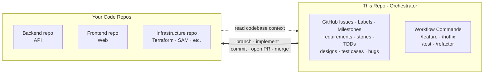
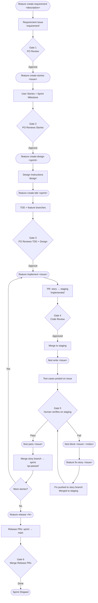
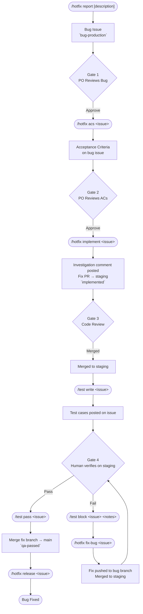
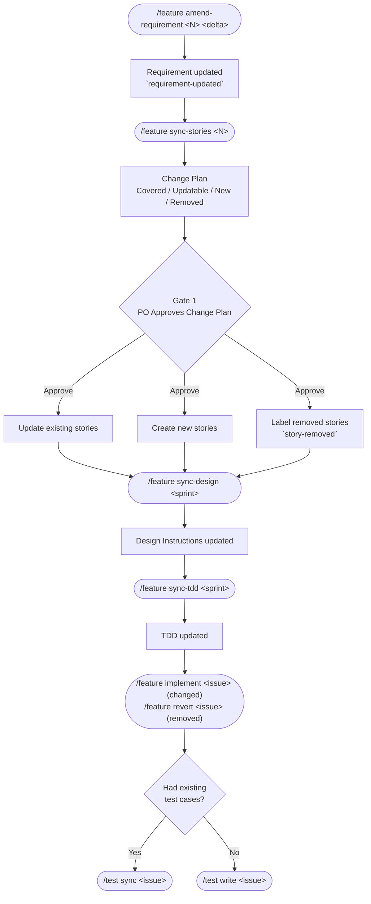
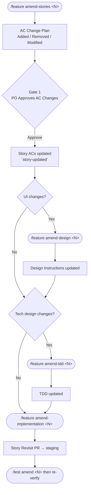
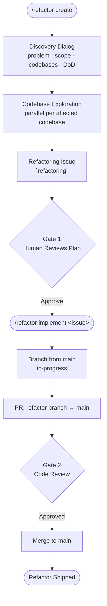

# GitHub-Native Human-Gated AI Workflow

> One control plane, many code planes.

A shared playbook for the whole team — PO, BA, Designer, Tech Lead, Dev, QA, Release Manager. Each role drives the stages it owns. Every artifact is a GitHub Issue. Labels move work forward. Humans gate every stage.

## 🤔 Why This Exists

Without a shared playbook, every team member prompts AI differently. Outputs diverge, context resets, and less-experienced users slow the team. This repo collapses the cycle into a handful of canonical workflows and labelled issues — anyone can advance work by running the next stage.

## 🧭 How It Works

- **Orchestrator, not a codebase.** Stories, sprints, designs, TDDs, and bugs live here as issues. Agents check out your real code repos (API, web, infra), registered once via `/setup init`.
- **GitHub is the source of truth.** No Jira, no Notion — every artifact is an issue; state changes by label, not chat.
- **Workflows organize lifecycle stages, roles run them.** Four workflows (`/feature`, `/hotfix`, `/test`, `/refactor`) cover complete lifecycles. PO triggers requirement/report stages, BA writes stories, Designer authors design instructions, Tech Lead writes TDDs and refactor plans, Dev implements, QA runs `/test`, Release Manager ships. Every stage is one command — the role that owns it runs it.
- **Humans gate every stage.** AI handles volume. Nothing ships without sign-off.
- **Drop-in.** Only `.claude/`, `config.md`, `PRODUCT.md`, and `DESIGN.md` are added. Existing issues, PRs, and branches stay untouched.



> [!IMPORTANT]
> No application code lives here. The orchestrator plans, tracks state, and drives agents — which branch, commit, and open PRs in your real repos.

---

## 🚀 Quick Start

**Prerequisites:** Claude Code CLI, GitHub CLI (`gh`), a GitHub repo with code.

```bash
# 1. Clone this workflow repo
git clone https://github.com/simpscal/notism.git

# 2. Copy the workflow into your existing project
cp -r notism/.claude /path/to/your/project/
```

In your project, run `/setup init` to:

- Generate `config.md` — registers codebases, detects tech stack, configures migration detection.
- Generate `PRODUCT.md` — captures vision, value proposition, business model, goals, and strategic direction.
- Generate `DESIGN.md` — extracts design tokens and component primitives for frontend work.
- Create GitHub labels (`requirement`, `user-story`, `qa-passed`, etc.). Safe to re-run.

Then kick off a sprint:

```
/feature create-requirement "Next feature on the backlog"
```

> [!TIP]
> Not sure which command to run? Use `/help-flows` — it asks your intent and prints the exact command to copy-paste.

> [!NOTE]
> Non-disruptive. Only `.claude/`, `config.md`, `PRODUCT.md`, and `DESIGN.md` are added. Existing issues, PRs, and branches stay untouched.

---

## ⚡ Commands

Five top-level commands. Each workflow command takes a **stage** that names the action; the **Run by** column below shows which role typically owns it.

### 🆕 `/feature` — Sprint feature lifecycle

Requirement → stories → design → TDD → dev → release. Absorbs mid-sprint requirement changes and single-story AC amendments. Testing handled by `/test`.

| Command | Run by | What it does |
|---------|--------|-------------|
| `/feature create-requirement <description>` | PO | Turn a free-text requirement into a tracker issue. |
| `/feature amend-requirement <req_issue> <delta>` | PO | Revise an existing requirement issue. |
| `/feature create-stories <requirement_issue>` | BA | Break a requirement into user stories under a new sprint milestone. |
| `/feature add-story <requirement_issue>` | BA | Append one extra story to the current sprint. |
| `/feature sync-stories <requirement_issue>` | BA | Reconcile existing stories with an amended requirement. |
| `/feature amend-stories <story_issue>` | BA | Change ACs on a single story. |
| `/feature merge-stories <target> <source...>` | BA | Fold source stories into a target story. |
| `/feature create-design <sprint_number>` | Designer | Author the sprint's design instructions (frontend). |
| `/feature sync-design <sprint_number>` | Designer | Update design instructions after stories changed. |
| `/feature amend-design <story_issue>` | Designer | Revise design for one amended story. |
| `/feature create-tdd <sprint_number>` | Tech Lead | Author the sprint's technical design document. |
| `/feature sync-tdd <sprint_number>` | Tech Lead | Update TDD after stories changed. |
| `/feature amend-tdd <story_issue>` | Tech Lead | Revise TDD for one amended story. |
| `/feature implement <story_issue>` | Dev | Implement a story — fresh, or delta-only when `story-updated`. |
| `/feature revert <story_issue>` | Dev | Undo work for a removed story (`story-removed`). |
| `/feature fix-story <story_issue>` | Dev | Re-implement after QA blocked (`qa-blocked`). |
| `/feature amend-implementation <story_issue>` | Dev | Re-implement after an AC amendment. |
| `/feature release <sprint_number>` | Release Manager | Close sprint and open release PRs to main. |

### 🐛 `/hotfix` — Production bug lifecycle

Faster lane — no design, no TDD; the bug ticket carries ACs and goes straight to fix → release. Testing handled by `/test`.

| Command | Run by | What it does |
|---------|--------|-------------|
| `/hotfix report [description]` | PO | Clarify the bug interactively and open a tracker issue with `bug-production`. |
| `/hotfix acs <bug_issue>` | BA | Analyse the bug and add Acceptance Criteria to the same ticket. |
| `/hotfix implement <bug_issue>` | Dev | Investigate root cause and apply the fix — fresh or delta-only on `story-updated`. |
| `/hotfix fix-bug <bug_issue>` | Dev | Re-fix after QA blocked (`qa-blocked`). |
| `/hotfix release <bug_issue>` | Release Manager | Merge the bugfix PR to main and close the bug. |

### 🧪 `/test` — QA test case lifecycle

Same workflow whether the target is a feature story or a production bug — adapts to the issue's labels.

| Command | Run by | What it does |
|---------|--------|-------------|
| `/test write <issue>` | QA | First-time test cases from the issue's ACs. |
| `/test sync <issue>` | QA | Reconcile test cases after a requirement change. |
| `/test amend <issue>` | QA | Revise cases after a single-story AC amendment. |
| `/test pass <issue>` | QA | Mark `qa-passed` after human verification. |
| `/test block <issue> <notes>` | QA | Mark `qa-blocked` and capture failure notes. |

### 🧹 `/refactor` — Tech-debt and structural cleanup

No sprint, no QA. Branch from `main`, PR to `main`. DoD: existing tests pass, no behaviour change.

| Command | Run by | What it does |
|---------|--------|-------------|
| `/refactor create` | Tech Lead | Survey the codebase, draft a refactor plan, open a `refactoring` issue. |
| `/refactor amend <refactor_issue>` | Tech Lead | Revise an existing refactor plan. |
| `/refactor implement <refactor_issue>` | Dev | Implement the plan — preserves observable behaviour. |

### 🛠 `/setup` — One-off setup (utility)

| Command | Run by | What it does |
|---------|--------|-------------|
| `/setup init` | Project lead | Bootstrap project config — generate `config.md`, `PRODUCT.md`, `DESIGN.md` interactively. |
| `/setup pcd create` | PO | Generate `PRODUCT.md` from scratch. |
| `/setup pcd amend [section]` | PO | Revise one section of `PRODUCT.md` (or all if omitted). |
| `/setup design-system create` | Designer | Generate `DESIGN.md` from the web codebase. |
| `/setup design-system amend` | Designer | Update `DESIGN.md` after design system changes. |

### 🧭 `/help-flows` — Workflow picker (utility)

| Command | What it does |
|---------|-------------|
| `/help-flows` | Asks intent, prints exact next command to copy-paste. |
| `/help-flows <intent>` | Free-text intent (e.g. `i want to fix a bug`); resolves to one command. |
| `/help-flows all` | Prints full cheat sheet of every stage. |

---

## 🔄 Workflows

<details>
<summary><strong>Feature Development</strong> — the standard sprint cycle</summary>

Story branches merge to **staging** for QA, then to the **sprint branch** on pass. Sprint branch stays clean.



</details>

<details>
<summary><strong>Production Hotfix</strong> — bugs found in production</summary>

Independent of sprint cycle. Fix PRs hit **staging** for QA, then `main`.



</details>

<details>
<summary><strong>Requirements Change</strong> — scope shifts mid-sprint</summary>

Cascades through stories, design, TDD, dev, and QA incrementally. All stages of `/feature` — no separate workflow.



</details>

<details>
<summary><strong>Story Change</strong> — AC-level amendments</summary>

AC adjustments to a single story — not the full requirement. Still stages of `/feature`.



**When to amend design and TDD:**

| Change type | Design | TDD |
|-------------|--------|-----|
| New UI surface or interaction | Yes | Maybe |
| Changed layout, component, or visual state | Yes | Maybe |
| New API endpoint or data model | No | Yes |
| Changed business logic or backend behaviour | No | Yes |
| UI + backend change together | Yes | Yes |
| Copy/label wording only | No | No |

</details>

<details>
<summary><strong>Refactoring</strong> — tech-debt and structural cleanup</summary>

No sprint, no QA. Branch from `main`, PR to `main`. DoD requires existing tests pass and no user-visible behavior change — the QA substitute.



</details>

---

## 📌 GitHub is the Source of Truth

No external tracker. No Jira, no Notion, no spreadsheet. Every artifact lives in GitHub:

| Artifact | Lives in |
|----------|---------|
| Requirement | GitHub Issue (`requirement`) |
| User stories | GitHub Issues (`user-story`) grouped by Milestone |
| Sprint | GitHub Milestone |
| Design instructions | GitHub Issue (`design`) |
| Technical design (TDD) | GitHub Issue (`technical-design`) |
| Implementation | Pull Request linked to story issue |
| Test cases | Comment on the story issue |
| QA result | Label on the story issue |
| Release | Pull Request (sprint branch → main) |

**Labels are the workflow engine.** Workflow commands read them; humans apply them by running the next stage. A label is the current state and the instruction.

---

## 🏷️ Labels

Two purposes: **artifact type** and **lifecycle state**.

### 📦 Artifact Types

What the issue is. Set once on creation.

| | Label | Artifact |
|---|-------|---------|
|  | `requirement` | PO requirement created via `/feature create-requirement` |
|  | `user-story` | Story created via `/feature create-stories` or `add` |
|  | `technical-design` | TDD created via `/feature create-tdd` |
|  | `design` | Sprint-level UI/UX instructions via `/feature create-design` |
|  | `bug-production` | Production bug reported via `/hotfix report` |
|  | `refactoring` | Refactor plan created via `/refactor create` |

### 🔁 Lifecycle States

Where a story or bug sits in the pipeline. Change as work progresses; tell agents what's next.

| | Label | Meaning | What happens next |
|---|-------|---------|------------------|
|  | `in-progress` | Dev is currently implementing | — |
|  | `implemented` | PR merged to staging, awaiting QA | `/test write` |
|  | `qa-passed` | Human verified all test cases on staging | Human merges branch → sprint |
|  | `qa-blocked` | One or more test cases failed | `/feature fix-story` or `/hotfix fix-bug` |
|  | `story-updated` | ACs changed after implementation | `/feature implement` (revisit branch) |
|  | `story-removed` | Story dropped from scope | `/feature revert` |
|  | `requirement-updated` | Requirement changed mid-sprint | `/feature sync-stories` |
|  | `sprint-completed` | Sprint closed by `/feature release` | — |
|  | `bug-fixed` | Bug closed after `/hotfix release` | — |
