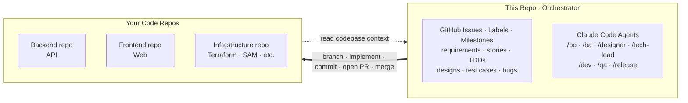
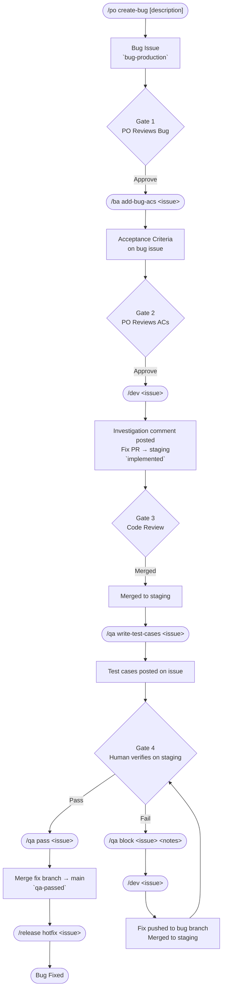
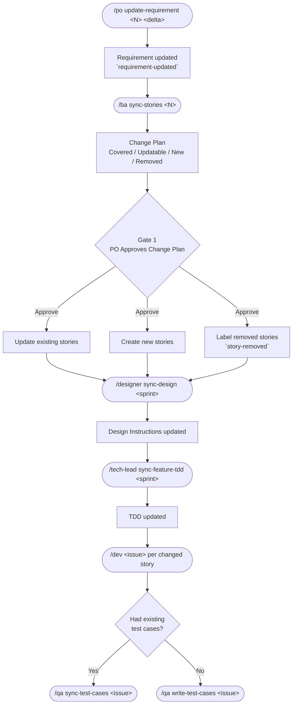
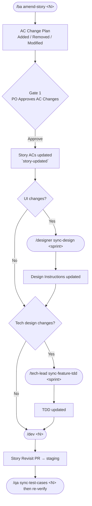
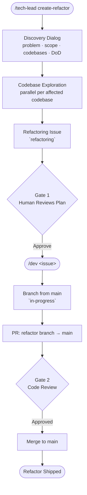

# GitHub-Native Human-Gated AI Workflow

> One control plane, many code planes.

Claude Code slash-commands that map development roles to AI agents. Each agent has a job, a scope, and a handoff — to another agent or a human.

- **Orchestrator, not a codebase.** This repo holds stories, sprints, and workflow state in GitHub Issues. Agents check out your real code repos (API, web, infra), registered once via `/init`.
- **Team-first.** PO, reviewers, QA, and devs operate on the same issues. Labels say what's next — no private AI threads, no silos.
- **GitHub is the source of truth.** Requirements, stories, designs, TDDs, test cases — every artifact is an issue. State changes by label, not by chat.
- **Humans gate every stage.** AI handles volume; humans approve. Nothing ships without sign-off.
- **Drop-in for existing codebases.** Agents read your repos and operate inside them, never around them.



> [!IMPORTANT]
> No application code lives here. The orchestrator plans, tracks state, and drives agents — which branch, commit, and open PRs in your real repos.

---

## 🚀 Quick Start

**Prerequisites:** Claude Code CLI, GitHub CLI (`gh`), a GitHub repo with code.

```bash
# 1. Clone this workflow repo
git clone https://github.com/simpscal/notism.git

# 2. Copy the workflow into your existing project
cp -r notism/.claude /path/to/your/project/
```

In your project, run `/init` to:

- Generate `config.md` — registers codebases, detects tech stack, configures migration detection.
- Generate `DESIGN.md` — extracts design tokens and component primitives for Designer and frontend agents.
- Create GitHub labels (`requirement`, `user-story`, `qa-passed`, etc.). Safe to re-run.

Then kick off a sprint:

```
/po create-requirement "Next feature on the backlog"
```

> [!TIP]
> Not sure which command to run? Use `/help-flows` — it asks your intent and prints the exact command to copy-paste.

> [!NOTE]
> Non-disruptive. Only `.claude/`, `config.md`, and `DESIGN.md` are added. Existing issues, PRs, and branches stay untouched.

---

## ⚡ Commands

### 📋 Product Owner

| Command | What it does |
|---------|-------------|
| `/po create-requirement <description>` | Creates a requirement issue |
| `/po update-requirement <issue> <delta>` | Updates requirement mid-sprint, cascades to stories |
| `/po create-bug [description]` | Creates a production bug issue |

### 📝 Business Analyst

| Command | What it does |
|---------|-------------|
| `/ba write-stories <issue>` | Decomposes requirement into user stories + sprint milestone |
| `/ba add-bug-acs <issue>` | Writes acceptance criteria onto a bug issue |
| `/ba sync-stories <issue>` | Re-classifies stories after requirement change |
| `/ba amend-story <issue>` | Amends ACs on a user story |

### 🎨 Designer

| Command | What it does |
|---------|-------------|
| `/designer write-design <sprint>` | Produces sprint-level design instructions |
| `/designer sync-design <sprint>` | Updates design instructions after story changes |

### 🏗️ Technical Lead

| Command | What it does |
|---------|-------------|
| `/tech-lead write-feature-tdd <sprint>` | Writes TDD + creates feature branches for sprint |
| `/tech-lead sync-feature-tdd <sprint>` | Updates TDD after story changes |
| `/tech-lead create-refactor` | Designs a standalone refactoring task — explores affected codebases, drafts plan, creates `refactoring` issue |

### 💻 Developer

| Command | What it does |
|---------|-------------|
| `/dev <issue>` | Implements a story or bug — auto-routes by label (see [Labels](#labels)) |

### 🧪 QA Engineer

| Command | What it does |
|---------|-------------|
| `/qa write-test-cases <issue>` | Generates test cases from story ACs |
| `/qa sync-test-cases <issue>` | Updates test cases after AC changes |
| `/qa pass <issue>` | Marks story passed — triggers sprint merge |
| `/qa block <issue> <notes>` | Marks story blocked — triggers dev QA-fix cycle |

### 🚢 Release Manager

| Command | What it does |
|---------|-------------|
| `/release sprint <N>` | Closes sprint, opens release PRs to main |
| `/release hotfix <issue>` | Closes bug issue, deletes fix branch, posts summary |

### 🧭 Workflow Picker

| Command | What it does |
|---------|-------------|
| `/help-flows` | Asks intent, prints exact next command to copy-paste |
| `/help-flows <intent>` | Free-text intent (e.g. `i want to fix bug`); resolves to one command |
| `/help-flows all` | Prints full cheat sheet of every stage |

---

## 🔄 Workflows

<details>
<summary><strong>Feature Development</strong> — the standard sprint cycle</summary>

Story branches merge to **staging** for QA, then to the **sprint branch** on pass. Sprint branch stays clean.


</details>

<details>
<summary><strong>Production Hotfix</strong> — bugs found in production</summary>

Independent of sprint cycle. Fix PRs hit **staging** for QA, then `main`.



</details>

<details>
<summary><strong>Requirements Change</strong> — scope shifts mid-sprint</summary>

Cascades through stories, design, TDD, dev, and QA incrementally.



</details>

<details>
<summary><strong>Story Change</strong> — AC-level amendments</summary>

AC adjustments to a single story — not the full requirement.



**When to involve Designer and TL:**

| Change type | Designer | TL |
|-------------|----------|----|
| New UI surface or interaction | Yes | Maybe |
| Changed layout, component, or visual state | Yes | Maybe |
| New API endpoint or data model | No | Yes |
| Changed business logic or backend behaviour | No | Yes |
| UI + backend change together | Yes | Yes |
| Copy/label wording only | No | No |

</details>

<details>
<summary><strong>Refactoring</strong> — tech-debt and structural cleanup</summary>

Tech Lead initiated. No sprint, no QA. Branch from `main`, PR to `main`. DoD requires existing tests pass and no user-visible behavior change — the QA substitute.



</details>

---

## 📌 GitHub is the Source of Truth

No external tracker. No Jira, no Notion, no spreadsheet. Every artifact lives in GitHub:

| Artifact | Lives in |
|----------|---------|
| Requirement | GitHub Issue (`requirement`) |
| User stories | GitHub Issues (`user-story`) grouped by Milestone |
| Sprint | GitHub Milestone |
| Design instructions | GitHub Issue (`design`) |
| Technical design (TDD) | GitHub Issue (`technical-design`) |
| Implementation | Pull Request linked to story issue |
| Test cases | Comment on the story issue |
| QA result | Label on the story issue |
| Release | Pull Request (sprint branch → main) |

**Labels are the workflow engine.** Agents read them; humans apply them via commands. A label is the current state and the instruction.

---

## 🏷️ Labels

Two purposes: **artifact type** and **lifecycle state**.

### 📦 Artifact Types

What the issue is. Set once on creation.

| | Label | Artifact |
|---|-------|---------|
|  | `requirement` | PO-created requirement |
|  | `user-story` | BA-created user story |
|  | `technical-design` | Technical design document (TDD) |
|  | `design` | Sprint-level UI/UX instructions |
|  | `bug-production` | Production bug reported by PO |
|  | `refactoring` | Tech-lead initiated refactor task |

### 🔁 Lifecycle States

Where a story or bug sits in the pipeline. Change as work progresses; tell agents what's next.

| | Label | Meaning | What happens next |
|---|-------|---------|------------------|
|  | `in-progress` | Dev is currently implementing | — |
|  | `implemented` | PR merged to staging, awaiting QA | `/qa write-test-cases` |
|  | `qa-passed` | Human verified all test cases on staging | Human merges branch → sprint |
|  | `qa-blocked` | One or more test cases failed | `/dev <issue>` → QA Fix mode |
|  | `story-updated` | ACs changed after implementation | `/dev <issue>` → Story Revisit mode |
|  | `story-removed` | Story dropped from scope | `/dev <issue>` → Revert mode |
|  | `requirement-updated` | Requirement changed mid-sprint | `/ba sync-stories` |
|  | `sprint-completed` | Sprint closed by Release Manager | — |
|  | `bug-fixed` | Bug closed after hotfix release | — |