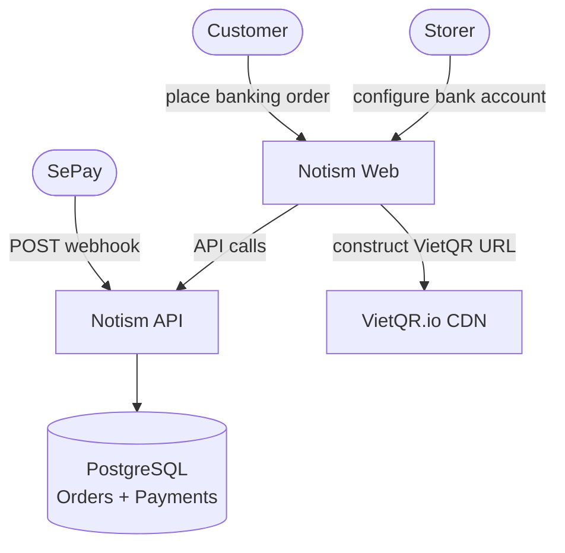
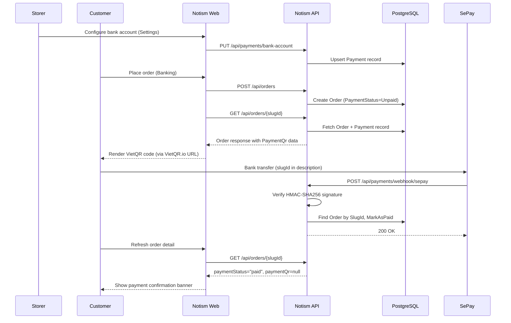
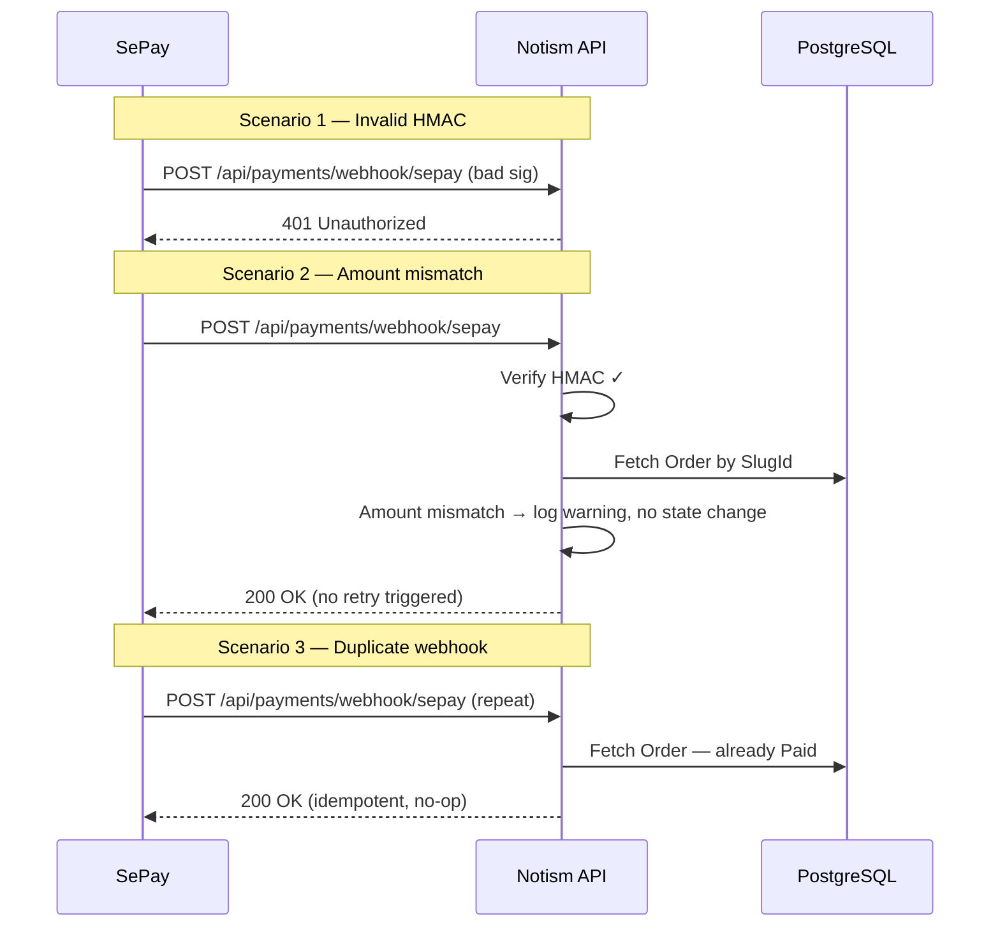

# Sprint 2 — Technical Design Document

> Source: simpscal/notism#21
> Sprint: Sprint 2
> Archived: 2026-04-06

---

Part of #16

# Sprint 2 — Technical Design Document

## 1. Executive Summary

**Status**: Approved
**Author**: Alex (TL) | **Reviewer**: —

### Problem Statement
Orders can currently only be paid cash-on-delivery, requiring manual payment collection by the storer. The system needs internet banking support so customers pay by scanning a VietQR code and the order auto-confirms when SePay reports a matching bank transfer — removing the manual step entirely.

### Goals
- Storer can configure their bank account in Settings
- Customer sees a VietQR code after placing a banking order
- Order auto-confirms when SePay webhook reports a matching transfer
- Storer can see and filter orders by payment status

### Non-Goals
- Multi-account bank configuration
- Real-time WebSocket payment confirmation (page refresh is acceptable)
- Full transaction history list
- Cash-on-delivery automatic payment confirmation
- Other payment gateways (Stripe, VNPay, PayOS) — SePay only this sprint

---

## 2. Architectural Design

### High-Level Diagram



### Integration Flows

#### Happy Path



#### Unhappy Path



### Technology Stack
No new languages, frameworks, or infrastructure. Additions within existing stack:
- **SePay** — third-party payment webhook provider (new external integration)
- **VietQR.io** — CDN URL pattern for QR rendering (no API call; URL constructed client-side)

---

## 3. Data & Interface Contracts

### Data Models

**New table: `Payments`**

| Column | Type | Constraints |
|--------|------|-------------|
| Id | uuid | PK |
| StorerId | uuid | FK → Users, UNIQUE index |
| BankCode | varchar | NOT NULL |
| AccountNumber | varchar | NOT NULL |
| AccountHolderName | varchar | NOT NULL |
| CreatedAt | timestamptz | NOT NULL |
| UpdatedAt | timestamptz | NOT NULL |

**Modified table: `Orders`** (additive columns only)

| Column | Type | Constraints |
|--------|------|-------------|
| PaymentStatus | int | NOT NULL, default 0 (Unpaid) |
| PaidAt | timestamptz | nullable |

**ERD (affected tables)**

```
Users ──< Payments   (1 storer → 0..1 bank account)
Users ──< Orders     (1 storer → many orders)
Orders has PaymentStatus, PaidAt
```

### API Specification

| Method | Route | Auth | Request Body | Response | Status Codes |
|--------|-------|------|-------------|----------|--------------|
| GET | `/api/payments/bank-account` | RequireAdmin | — | `{ bankCode, accountNumber, accountHolderName }` or `null` | 200 |
| PUT | `/api/payments/bank-account` | RequireAdmin | `{ bankCode, accountNumber, accountHolderName }` | — | 200, 400 |
| POST | `/api/payments/webhook/sepay` | HMAC-SHA256 header | `{ transactionId, amount, description, transferredAt }` | — | 200, 401 |
| GET | `/api/orders/{slugId}` *(modified)* | Bearer | — | Order + `paymentStatus`, `paidAt`, `paymentQr?` | 200, 404 |
| GET | `/api/orders` *(modified)* | Bearer | `?paymentStatus=` filter | Order list + `paymentStatus`, `paidAt` per item | 200 |

**`paymentQr` object** (returned only when `paymentMethod=Banking` AND `paymentStatus=Unpaid`):
```json
{
  "bankCode": "string",
  "accountNumber": "string",
  "accountHolderName": "string",
  "amount": 0,
  "orderReference": "ORD-XXXX"
}
```
Frontend constructs the VietQR.io URL from this object. When paid or non-banking, `paymentQr` is `null`.

### Event Schemas

**`OrderPaidEvent`** — raised on `order.MarkAsPaid(paidAt)`, consumed in-process only (no message bus):

| Field | Type | Description |
|-------|------|-------------|
| OrderId | Guid | The order that was paid |
| UserId | Guid | The storer who owns the order |
| PaidAt | DateTime | Timestamp of the bank transfer |

---

## 4. Risk & Trade-offs

### Alternatives Considered

| Decision | Chosen | Alternative | Why Alternative Was Rejected |
|----------|--------|-------------|------------------------------|
| Bank account storage | New `Payment` aggregate | Add bank fields to `User` | `User` is the auth aggregate; SRP violation |
| `PaymentStatus` location | `Payment` domain namespace | `Order` domain enum | Payment status is a payment concept; belongs in Payment domain |
| QR generation | Backend returns raw data; frontend constructs VietQR.io URL | Backend calls VietQR.io API | Avoids a synchronous external HTTP call on every order detail load |
| Payment gateway | SePay webhook only | VNPay / PayOS | Simplest webhook model for bank transfer matching this sprint |
| Webhook error handling | Always return 200; log silently | Return 4xx on mismatch | SePay retries on non-2xx; idempotent 200 avoids duplicate processing |
| PaymentStatus scope | All orders (Unpaid default) | Banking orders only | Consistent filter surface; avoids nullable complexity |

### Security
- **Webhook authentication**: `POST /api/payments/webhook/sepay` verifies `X-Sepay-Signature` header (HMAC-SHA256 of raw body against `SepaySettings:WebhookSecret`). Returns 401 if invalid.
- **Bank account endpoint**: protected by existing `RequireAdmin` middleware — only the authenticated storer can read or write their own bank details.
- **No sensitive data in QR**: VietQR payload contains bank code, account number, and amount — same data printed on any bank invoice. No PII beyond what the storer intentionally shares.
- **Data at rest**: no additional encryption beyond existing DB-level controls; bank account data is not classified as secret.

### Scalability & Performance
- **Webhook throughput**: SePay sends one webhook per transfer. Expected volume is low (< 100 TPS peak). Single DB write per webhook is sufficient.
- **Order detail latency**: `GET /api/orders/{slugId}` performs one additional join to `Payments`. No N+1 risk — single query with JOIN.
- **QR rendering**: fully client-side via VietQR.io CDN URL; zero server load.
- **Scaling**: horizontal scaling of the API is unaffected — webhook handler is stateless and idempotent.

### Failure Modes

| Scenario | Impact | Mitigation |
|----------|--------|------------|
| VietQR.io CDN unavailable | Customer cannot see QR image | `` renders text fallback with bank details |
| Duplicate SePay webhook delivery | Double-processing risk | Idempotency check: no-op if `order.PaymentStatus == Paid` |
| Transfer amount mismatch | Order stays Unpaid silently | Log warning with `transactionId`; storer can manually confirm |
| HMAC secret misconfigured | All webhooks rejected (401) | Integration test covers signature path; secret documented in env template |
| VietQR bank code not standard | QR may not scan at all banks | Free-form string field — storer corrects in Settings |
| DB unavailable during webhook | Webhook fails; SePay retries | SePay retries with exponential backoff; no data loss |

---

## 5. Implementation & Observability

### Milestones

| Phase | Scope | Deliverable |
|-------|-------|-------------|
| 1 — Core Backend | Payment aggregate, SaveBankAccount, GetBankAccount, bank-account endpoints, DB migration | Story #17 |
| 2 — Webhook | HandleSepayWebhook command, HMAC verification, OrderPaidEvent, MarkAsPaid | Story #19 |
| 3 — Order Read Changes | GetOrderById + GetOrders return paymentStatus/paidAt/paymentQr | Story #18 (partial) |
| 4 — Frontend | Settings Payment tab, order detail QR, order list badges + filter | Stories #18, #20 |

### Monitoring & Alerting
- **Webhook 401 rate**: alert if > 5 consecutive 401s from SePay IP range — indicates HMAC misconfiguration
- **Webhook silent failures**: log `WARN` on amount mismatch with `{ transactionId, orderId, expected, received }` — reviewable in log aggregator
- **Order payment lag**: no automated alert needed this sprint (page-refresh confirmation is acceptable)

### Migration Plan
- Migration name: `AddPaymentSupport`
- Additive only: new `Payments` table + two nullable/defaulted columns on `Orders`
- No data backfill needed — existing orders default to `PaymentStatus = 0 (Unpaid)`
- Rollback: migration is reversible (drop columns + table); no data loss on rollback

---

## Architecture Alignment

| Rule | Status | Note |
|------|--------|------|
| New aggregate follows `AggregateRoot` base + private constructor | ✅ Pass | `Payment` mirrors `Order` pattern |
| Repository interface in Domain, impl in Infrastructure | ✅ Pass | `IPaymentRepository` in Domain; `PaymentRepository` in Infrastructure |
| Each CQRS feature: own folder with Request/Validator/Handler/Response | ✅ Pass | All new commands/queries follow this |
| EF migration for every schema change | ✅ Pass | `AddPaymentSupport` covers new table + two Order columns |
| Endpoints only do HTTP translation, delegate to `ISender.Send()` | ✅ Pass | HMAC verification is the only endpoint-level logic |
| FluentValidation inline in command file | ✅ Pass | Validators for `SaveBankAccount` and `HandleSepayWebhook` |
| Result<T> / ResultFailureException for business failures | ✅ Pass | Webhook logs silently; all other handlers follow existing pattern |
| Frontend: no API calls in Redux store | ✅ Pass | Bank account uses TanStack Query only |
| Frontend: API models → feature ViewModels | ✅ Pass | `OrderPaymentQrViewModel` in `features/order/models/` |
| `CreateOrderRequestValidator` Banking restriction | ⚠️ Needs fix | Remove `.Must(...)` rule blocking `Banking` — addressed in #17 |

## Architecture Key Decisions

> Downstream dev subagents: read this section instead of re-reading full architecture docs.

- **Layer responsibilities**: Domain owns aggregates, value objects, repository interfaces, and domain events. Application owns commands/queries (CQRS via MediatR). Infrastructure owns EF Core implementations. API layer is HTTP translation only.
- **Naming conventions**: Commands → `VerbNounCommand` + `VerbNounCommandHandler`; Queries → `GetNounQuery` + handler; endpoints → `NounEndpoints.cs`; frontend feature → `features/{noun}/`.
- **Adding a new feature checklist**: (1) Domain aggregate + repository interface, (2) Application command/query folder with Request/Validator/Handler/Response, (3) Infrastructure repository + EF config, (4) EF migration, (5) API endpoint registration, (6) Frontend API model + feature ViewModel + component.
- **Cross-cutting patterns**: Handlers return `Result<T>` or throw `ResultFailureException` for business rule violations. FluentValidation runs before handlers via pipeline behaviour. Webhook handlers always return 200 and log non-fatal failures.
- **Component/file organisation**: `src/Notism.Domain/{Aggregate}/`, `src/Notism.Application/{Feature}/`, `src/Notism.Infrastructure/`, `src/Notism.Api/Endpoints/`; frontend: `src/features/{noun}/`, `src/apis/`, `src/pages/{noun}/`.

## Story Dependencies

1. **#17** — no dependencies (new `Payment` aggregate + migration + unlock Banking in CreateOrder)
2. **#18** — depends on #17 backend (bank account must exist to build QR response and frontend Settings tab)
3. **#19** — depends on #17 backend (`MarkAsPaid` on Order and `Payment` table must exist)
4. **#20** — depends on #19 (payment status filter and badges require paymentStatus on Order)

---

## Lead's Review Checklist
- [x] Is there a single point of failure? → SePay webhook is the only confirmation path. Mitigation: idempotency + logging + storer can manually review logs.
- [x] Does this design introduce technical debt we'll regret in 6 months? → VietQR URL construction is client-side only; if VietQR.io changes URL schema, frontend update needed. Acceptable for now.
- [x] Could a developer who wasn't in the meetings build this from this document alone? → Yes.
